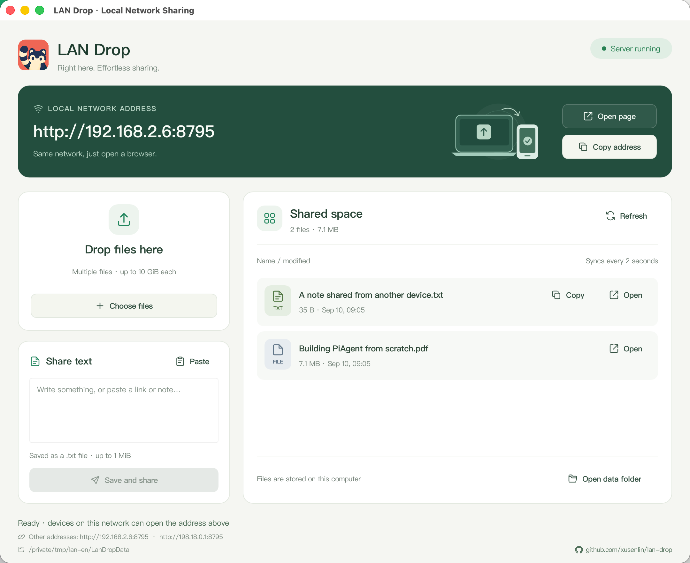
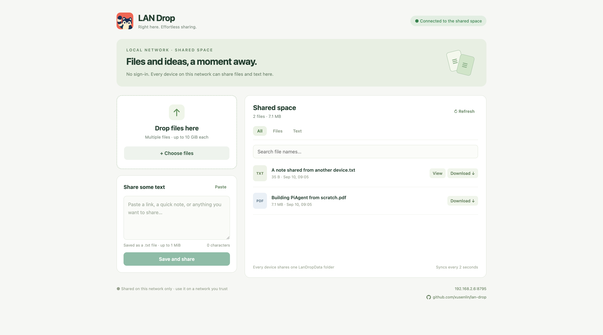

# LAN Drop

**English** · [简体中文](README.zh-CN.md)

A LAN file and text sharing app written in Rust + Slint. Launch the desktop app and an HTTP server starts with it — any computer, phone or tablet on the same network can upload and download straight from a browser. No accounts.

## Highlights

**No webview.** The desktop UI is drawn by Slint directly, rather than running a browser engine locally the way Electron or Tauri does. There is no WebView2 to install, and no webkit2gtk or GTK stack needed on Linux — the Linux build has exactly three dynamic dependencies:

```
libc.so.6  libm.so.6  libgcc_s.so.1
```

**Small, single file, no installer.** The UI, the icons and the whole web front end are compiled into the executable:

| Platform | Size |
| --- | --- |
| macOS / Apple Silicon | 3.7 MB |
| Windows / x64 | 4.6 MB |
| Linux / x64 | 7.3 MB |

Drop it anywhere and run it; delete it and nothing is left behind. It writes no registry keys, installs no service and leaves no background process. The Windows build links the CRT statically, so there is no VC++ runtime to install first.

**Software rendering, runs anywhere.** No GPU driver and no OpenGL required, so it displays correctly in virtual machines, over remote desktop and on old hardware.

**Stays on your LAN.** No account, no cloud, no telemetry. Files sit in a plain `LanDropData/` directory you can open at any time. The other device needs nothing but a browser.

## Screenshots

Desktop: drop in files or paste text; the LAN address is shown at the top.



Web: open the address from any device on the same network — search, filter, preview and download.



## Usage

Put the binary for your platform in a **writable directory** and start it:

| Platform | File |
| --- | --- |
| macOS / Apple Silicon | `dist/LAN Drop.app` |
| Windows / x64 | `dist/lan-drop-windows-x64.exe` |
| Linux / x64 | `dist/lan-drop-linux-x64` |

macOS ships only the `.app`, with no separate bare binary — the contents are identical, but double-clicking a bare binary in Finder launches it through Terminal, which adds a stray terminal window and gives it no icon or Dock name. For command line use, call `LAN Drop.app/Contents/MacOS/lan-drop --headless` directly.

The desktop window shows the real address, for example `http://192.168.1.10:8765`. Click the address or "Open page" to open it; "Copy address" copies it so you can send it to another device.

- Drag files onto the desktop window or the web page, or click "Choose files"; multiple files are supported.
- Paste into the text box and click "Save and share" to store it as a UTF-8 `.txt` file. The file name is taken from the first 28 characters of the content, with newlines and characters that are illegal in file names replaced by spaces; if there is nothing usable at the start, `text-<timestamp>.txt` is used instead.
- Files and text all live in **`LanDropData/`**, regardless of the shell's working directory; it is created on first launch. Where it goes:

  | Case | Data directory |
  | --- | --- |
  | Bare binary | `LanDropData/` next to the executable |
  | macOS `.app` in Downloads, Desktop, a USB drive, … | `LanDropData/` **next to** the `.app` (stays portable, no install) |
  | macOS `.app` installed into `/Applications` | `~/LanDropData/` in your home directory |

  Data is never written inside the `.app` bundle, which would break its code signature. The location changes under `/Applications` because that directory is owned by `root:admin` — an admin account can write there and would silently end up with a user data directory inside a system folder, while a non-admin account cannot write there at all. The window footer always shows the path in use.

- Both the desktop and the web page refresh the shared list every 2 seconds. The web page supports search by name, filtering by type, text preview and copy, downloads, and upload progress.
- Name collisions get `(1)`, `(2)` appended; existing files are never overwritten. Uploads and copies go through a temporary file and only appear in the list once complete; failed requests clean their temporary files up.
- Up to 10 GiB per file and 1 MiB per text; compress folders first. An interrupted file has to be uploaded again — resumable uploads are not supported yet.
- You can add or remove regular files in `LanDropData/` directly and the list follows along. Hidden files, subdirectories and symlinks are not shared.
- Closing the app stops the HTTP server; files already saved stay. Do not close it during a transfer.

It listens on `0.0.0.0:8765` by default; if that port is taken it tries the next 20 and the UI shows the one it settled on. IPv4 addresses for every interface are listed in the window footer. If only `127.0.0.1` is shown, connect to the LAN first and restart the app. Restart it after switching networks or changing IP as well.

```sh
'./LAN Drop.app/Contents/MacOS/lan-drop' --port 9000
./lan-drop-linux-x64 --headless --port 8765
```

`--headless` starts only the HTTP server, which suits a Linux box with no desktop; `--port 0` picks a free port and writes the address to stdout. A normal desktop launch shows no console window on Windows.

A plain-HTTP page on a LAN is limited by browser clipboard permissions: if the paste button cannot read the clipboard, press `Ctrl+V` / `⌘+V` in the input box, or long-press to paste on a phone. Copying text falls back to manual selection.

## Building

Development requirements: Rust 1.88.0 (pinned by `rust-toolchain.toml`), [Task](https://taskfile.dev/), Python 3.9+. Building all three platforms additionally needs **macOS + Xcode Command Line Tools + a running Docker**. The macOS SDK comes from the host; Windows and Linux use the Docker toolchain in this repository. The first build downloads dependencies; later ones reuse the Cargo and Docker caches.

```sh
task build          # release binaries for all three platforms, plus SHA256SUMS
task build:native   # current system only; Intel Mac supported too
task build:cross    # Windows x64 and Linux x64 via Docker
task run            # run in development
task test           # storage and HTTP integration tests
task check          # rustfmt + clippy
```

`task build` has to run on a macOS host; on a Linux or Windows machine use `task build:native`. The macOS artifact from a full three-platform build is arm64. The cross toolchain is defined in `scripts/Dockerfile.cross` as image `lan-drop-cross:rust-1.88-v1`; the Cargo registry and build artifacts live in Docker volumes dedicated to this project. `Cargo.lock` pins dependencies and builds pass `--locked`.

**At runtime it needs no Rust, Python, Docker, Node.js, Qt, WebView, or loose HTML and asset files.** The Slint UI is compiled ahead of time, the web page is embedded with `include_str!`, and rendering is done in software. Dynamic libraries and desktop services that ship with the OS are still required: system frameworks on macOS, system DLLs on Windows; on Linux a glibc desktop (the cross build targets Debian 12, glibc 2.36+) with X11 or XWayland, and the file picker uses the desktop portal. A pure Wayland desktop with no XWayland is out of scope for now — use `--headless` there. The interface text is English, but shared file names can be in any language, and the software renderer draws a whole string with one font — there is no per-glyph fallback. So the app picks a system font with CJK coverage: PingFang on macOS, Microsoft YaHei on Windows, and fontconfig's sans-serif on Linux, where a font such as Noto Sans CJK SC has to be installed. A font missing those characters renders them as boxes; `SLINT_DEFAULT_FONT` can point at a specific font file or directory.

## Network and data

This is a LAN drop directory that every visitor can read and write, with no accounts, passwords or TLS — use it only on a network you trust. Allow local network access when the system firewall asks; no router port forwarding is needed. Guest Wi-Fi, AP isolation and VPNs may keep devices from reaching each other. Do not expose this port to the internet.

File names and directory access are restricted: path traversal, symlinks and Windows reserved names are rejected, and browser uploads require same-origin plus a custom header. Downloads are forced as attachments and text previews are handled as plain text. The shared directory only accepts portable, ordinary file names (at most 200 UTF-8 bytes, none of `\ / : * ? " < > |`).

## Layout

```text
src/main.rs          desktop app, drag and drop, clipboard, interface addresses, startup and lifecycle
src/store.rs         shared directory, naming, streaming copies, atomic saves
src/server.rs        Axum HTTP API, streaming uploads and downloads
ui/app.slint         root window: state, callbacks and component wiring shared with Rust
ui/theme.slint       colors, type scale, and the per-platform font Rust fills in
ui/types.slint       structs shared with Rust
ui/components/       UI blocks and icon buttons with keyboard focus
ui/icons/            embedded SVG action icons, device and empty-state art
web/index.html       embedded responsive web page, no CDN or build step
assets/app-icon.png  1024x1024 master icon, the single source (rounded corners baked into alpha)
assets/app-icon-256.png  derived from the master, embedded for the UI, window icon and web page
assets/app-icon.ico  derived from the master, the Windows executable resource icon
screenshots/         README screenshots, shared by both READMEs; not shipped in the binary
scripts/build.py     three-platform build, icon derivation, macOS .app packaging and checksums
scripts/Dockerfile.cross  Windows/Linux cross-compilation environment
Taskfile.yml         development and build commands
```

Licensing options for Slint are described in [Slint's terms and conditions](https://slint.dev/terms-and-conditions). Follow the conditions of whichever license you pick when you ship.
