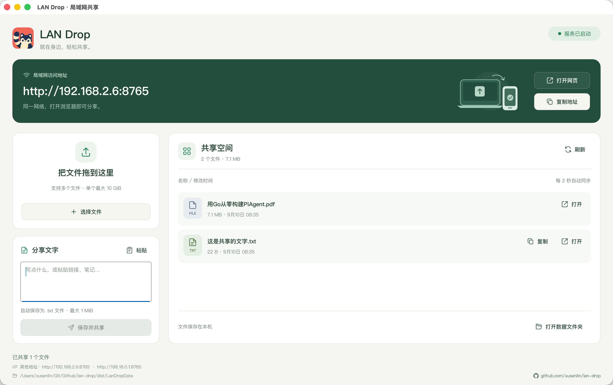
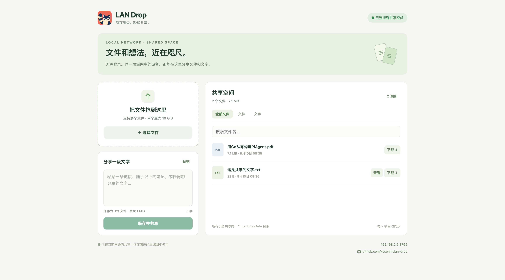

# LAN Drop

Rust + Slint 编写的局域网文件与文字共享 App。启动桌面端即开启 HTTP 服务，同一局域网内的电脑、手机和平板可直接用浏览器上传和下载，无需账号。

## 特点

**不套 webview。** 桌面界面由 Slint 直接绘制，不是 Electron / Tauri 那样在本地再跑一个浏览器内核。装的时候不需要 WebView2，Linux 上也不需要 webkit2gtk、GTK 这一串东西——Linux 版实际的动态依赖只有三个：

```
libc.so.6  libm.so.6  libgcc_s.so.1
```

**体积很小，单文件免安装。** 界面、图标和网页端全部编进可执行文件：

| 平台 | 大小 |
| --- | --- |
| macOS / Apple Silicon | 3.7 MB |
| Windows / x64 | 4.6 MB |
| Linux / x64 | 7.3 MB |

放哪儿都能跑，删掉就干净了，不写注册表、不装服务、不留后台进程。Windows 版静态链接 CRT，不用先装 VC++ 运行库。

**软件渲染，不挑机器。** 不依赖 GPU 驱动和 OpenGL，虚拟机、远程桌面、老机器上都能正常显示。

**只在局域网里，数据不出本机。** 没有账号、没有云端、没有遥测，文件就躺在 `LanDropData/` 目录里，随时能直接打开。对面设备只要有浏览器就行，不用装任何东西。

## 截图

桌面端：拖入文件或粘贴文字，顶部显示局域网访问地址。



网页端：同一局域网的任意设备打开地址即可，支持搜索、筛选、预览与下载。



## 使用

将对应平台的二进制放到一个**可写目录**并启动：

| 平台 | 文件 |
| --- | --- |
| macOS / Apple Silicon | `dist/LAN Drop.app` |
| Windows / x64 | `dist/lan-drop-windows-x64.exe` |
| Linux / x64 | `dist/lan-drop-linux-x64` |

macOS 只产出 `.app`，不再单独提供裸二进制——两者内容完全一样，而裸二进制在 Finder 里双击会经由 Terminal 启动，多一个终端窗口，也没有图标和 Dock 名称。需要命令行时直接调用 `LAN Drop.app/Contents/MacOS/lan-drop --headless`。

桌面端显示实际访问地址，例如 `http://192.168.1.10:8765`。点击地址或“打开网页”可直接访问，“复制地址”方便发送给其他设备。

- 将文件拖进桌面窗口或网页，也可以点击“选择文件”，支持多文件选择。
- 在文字框粘贴内容，点击“保存并共享”，以 UTF-8 `.txt` 文件保存。文件名取内容开头的 28 个字符，换行和文件名不允许的字符换成空格；开头没有可用字符时用 `文字-<时间戳>.txt`。
- 文件和文字全部保存在 **`LanDropData/`**，与终端当前工作目录无关；首次启动自动创建。位置规则：

  | 情况 | 数据目录 |
  | --- | --- |
  | 裸二进制 | 可执行文件旁边的 `LanDropData/` |
  | macOS `.app`，放在下载、桌面、U 盘等处 | `.app` **旁边**的 `LanDropData/`（保持免安装、可携带） |
  | macOS `.app`，装进 `/Applications` | 个人目录下的 `~/LanDropData/` |

  `.app` 的数据不会写进 bundle 内部，那样会破坏代码签名。装进 `/Applications` 后之所以换位置，是因为那里属主为 `root:admin`——管理员账号能写，会被悄悄塞进一个用户数据目录，而非管理员账号根本写不了。窗口底部始终显示当前实际路径。
- 桌面与网页每 2 秒自动更新共享列表。网页支持名称搜索、类型筛选、文字预览与复制、文件下载、上传进度。
- 同名文件自动增加 `(1)`、`(2)`，不会覆盖已有文件。上传与复制使用临时文件，完成后才出现在列表中；失败请求自动清理临时文件。
- 单文件最大 10 GiB，文字最大 1 MiB；文件夹请先压缩。中断的文件需要重新上传，暂不支持断点续传。
- 可以直接在 `LanDropData/` 内增删普通文件，列表会同步更新；不共享隐藏文件、子目录或符号链接。
- 关闭 App 会停止 HTTP 服务，已经保存的文件会保留。不要在传输时关闭 App。

默认监听 `0.0.0.0:8765`；占用时尝试后续 20 个端口，界面显示最终端口。多个网卡的 IPv4 地址显示在窗口底部。仅有 `127.0.0.1` 时需先连接局域网，再重新启动 App。网络切换或 IP 改变后也请重新启动。

```sh
'./LAN Drop.app/Contents/MacOS/lan-drop' --port 9000
./lan-drop-linux-x64 --headless --port 8765
```

`--headless` 只启动 HTTP 服务，适合无桌面 Linux；`--port 0` 自动分配空闲端口，地址写入标准输出。默认桌面启动在 Windows 不显示控制台。

局域网 HTTP 页面受浏览器剪贴板权限限制：如“粘贴”按钮不能读取剪贴板，直接在输入框按 `Ctrl+V` / `⌘+V` 或手机长按粘贴即可。文字复制提供手动选择的回退。

## 构建

开发依赖：Rust 1.88.0（由 `rust-toolchain.toml` 固定）、[Task](https://taskfile.dev/)、Python 3.9+；三平台构建还需要 **macOS + Xcode Command Line Tools + 正在运行的 Docker**。macOS 的 SDK 由本机提供，Windows 和 Linux 使用仓库中的 Docker 构建工具链。首次构建需要联网下载依赖，后续复用 Cargo 和 Docker 缓存。

```sh
task build          # 一次生成以上三个平台的 release 二进制和 SHA256SUMS
task build:native   # 仅编译当前系统；另支持 Intel Mac
task build:cross    # 用 Docker 编译 Windows x64、Linux x64
task run            # 开发运行
task test           # 存储与 HTTP 集成测试
task check          # rustfmt + clippy
```

`task build` 需要在 macOS 主机执行；Linux/Windows 开发机可使用 `task build:native`。默认三平台 macOS 产物是 arm64。跨平台工具链定义在 `scripts/Dockerfile.cross`，镜像名为 `lan-drop-cross:rust-1.88-v1`；Cargo registry 与编译产物存储在项目专用 Docker volumes 中。`Cargo.lock` 固定依赖，构建使用 `--locked`。

**运行时无需 Rust、Python、Docker、Node.js、Qt、WebView、独立 HTML 或资源文件。** Slint 界面提前编译，网页通过 `include_str!` 嵌入程序，使用软件渲染。系统自带的动态库和桌面服务仍然必要：macOS 系统框架、Windows 系统 DLL；Linux 为 glibc 桌面系统（交叉构建基于 Debian 12，glibc 2.36+），需要 X11 或 XWayland，文件选择器使用系统桌面 Portal。纯 Wayland 且没有 XWayland 的桌面不在当前支持范围内，可使用 `--headless`。界面使用系统中文字体：macOS 用苹方，Windows 用微软雅黑，Linux 交给 fontconfig 的 sans-serif，因此 Linux 需要自行安装中文字体（如 Noto Sans CJK SC）；软件渲染器不做逐字回退，选中的字体缺汉字时会显示为方块，可用 `SLINT_DEFAULT_FONT` 环境变量指定字体文件或目录。

## 网络与数据

这是所有访问者共同读写的局域网中转目录，没有账号、密码或 TLS，仅应在信任的局域网中使用。允许系统防火墙的本地网络访问，不需要路由器端口转发。访客 Wi-Fi、AP 隔离或 VPN 可能阻止设备互通。不要将此端口暴露到公网。

程序限制文件名和目录访问，拒绝路径穿越、符号链接及 Windows 保留文件名；浏览器上传要求同源与自定义请求头。下载强制附件，文字预览按纯文本处理。共享目录只能使用跨平台兼容的普通文件名（不超过 200 UTF-8 字节，不含 `\\ / : * ? " < > |`）。

## 结构

```text
src/main.rs          桌面端、拖拽、剪贴板、网卡地址、启动与生命周期
src/store.rs         共享目录、命名、流式复制、原子保存
src/server.rs        Axum HTTP API、流式上传下载
ui/app.slint         根窗口：与 Rust 交互的状态、回调与组件装配
ui/theme.slint       配色、字号，以及由 Rust 按平台写入的字体
ui/types.slint       与 Rust 共享的结构体
ui/components/       各块界面组件、带键盘焦点的图标按钮
ui/icons/            内嵌 SVG 操作图标与设备、空状态插图
web/index.html       内嵌响应式网页，无 CDN 或构建依赖
assets/app-icon.png  1024×1024 图标母图，唯一来源（圆角已烤进 alpha 通道）
assets/app-icon-256.png  由母图派生，嵌进程序供界面、窗口图标和网页使用
assets/app-icon.ico  由母图派生，Windows 可执行文件的资源图标
scripts/build.py     三平台构建、图标派生、macOS .app 打包与校验和
scripts/Dockerfile.cross  Windows/Linux 交叉编译环境
Taskfile.yml         开发与构建命令
```

Slint 依赖的许可选项见 [Slint 官方许可说明](https://slint.dev/terms-and-conditions)。发布产品时请按选用的许可遵循相应条件。
